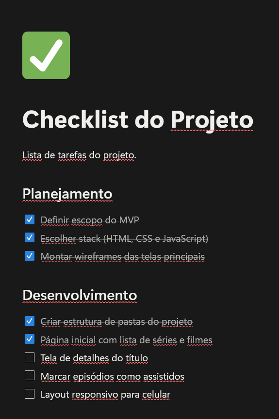
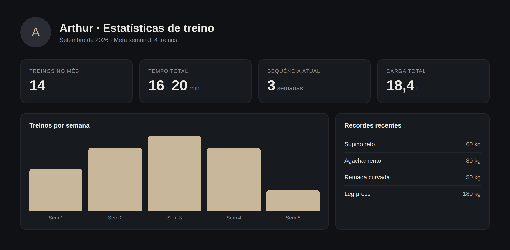
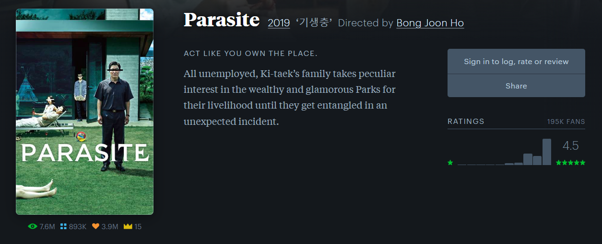

# References — Rewind

## 1. Objetivo

As referências abaixo orientam as decisões de experiência e interface do Rewind. Nem todas são do universo de filmes/séries (o Letterboxd é; o Notion e os apps de treino não) — foram escolhidas porque cada uma resolve bem um pedaço do nosso problema (organização, progresso, estatísticas e avaliação), como sugerido no enunciado.

## 2. Referência 01 — Notion

### Fonte
https://www.notion.so

### Imagem

### O que observamos?
Listas organizadas em grupos (como colunas ou seções), com itens que podem ser marcados como concluídos por meio de um checkbox simples e direto, sem exigir telas extras para uma ação tão pequena.

### O que vamos aproveitar?
A ideia de marcar progresso "no próprio item da lista", sem sair de contexto — aplicada à marcação de episódios assistidos.

### Como será adaptado?
Cada episódio, dentro do acordeão de temporadas (`SeasonAccordion` + `EpisodeItem`), vira uma linha com checkbox, igual a um item de lista do Notion: clicou, marcou, o progresso já é salvo — sem modais ou confirmações extras.

## 3. Referência 02 — Apps de treino (ex.: Strava, Technogym)

### Fonte
Tela ilustrativa (mockup), inspirada no padrão de estatísticas de apps de treino como o Strava (https://www.strava.com).

### Imagem

### O que observamos?
A tela de estatísticas resume o desempenho do usuário em poucos números grandes e diretos (treinos no mês, tempo total, sequência de semanas, carga total), seguidos de um gráfico de barras simples que compara períodos (treinos por semana) e de uma lista curta de destaques (recordes recentes).

### O que vamos aproveitar?
O padrão "números grandes primeiro, gráfico depois" para comunicar estatísticas pessoais de forma rápida de entender.

### Como será adaptado?
Na página de Estatísticas do Rewind, os `StatCard` (total de séries, episódios assistidos, horas estimadas, nota média) aparecem no topo em destaque, e logo abaixo o `GenreBarChart` mostra a distribuição de gêneros mais assistidos em barras simples — sem exigir nenhuma lib de gráficos, só `
`/`<svg>` com largura proporcional ao valor.

## 4. Referência 03 — Letterboxd

### Fonte
https://letterboxd.com

### Imagem

### O que observamos?
O Letterboxd mostra a nota em estrelas (com a média e a distribuição das avaliações) e as ações de registrar e avaliar na mesma página do filme, ao lado do pôster e do título, sem precisar de uma tela separada.

### O que vamos aproveitar?
A integração da nota (estrelas) e das ações do usuário diretamente na mesma tela de detalhes, sem exigir navegação extra.

### Como será adaptado?
Na página de Detalhe da Série, o `RatingStars` e o `StatusSelector` ficam lado a lado, próximos ao poster e ao nome da série — o usuário marca o status e dá a nota no mesmo lugar onde já está acompanhando o progresso dos episódios.

## 5. Direção visual própria — "Guia de Programação"

Em vez de seguir o padrão mais comum para esse tipo de app (dashboard escuro estilo streaming, cards arredondados com sombra), optamos por uma identidade visual própria, ligada ao próprio tema do trabalho: o fim do TV Time e a nostalgia de acompanhar programação de TV impressa e fitas VHS.

### O que observamos (fonte: memória visual de guias de TV impressos e capas de locadora, gênero amplamente documentado, não uma página específica)
Guias de programação impressos organizam o conteúdo em **linhas com réguas finas** (uma linha por programa/horário), não em cartões soltos. Capas e etiquetas de fita VHS usam **cores chapadas e saturadas** (mostarda, verde-petróleo, tijolo) em vez de gradientes, e elementos como selos e etiquetas costumam ter **cantos cortados**, não arredondados.

### O que vamos aproveitar?
- Listas como "linha de grade de horário" (hairlines entre itens) em vez de cards com sombra
- Paleta de cores chapadas, sem gradientes
- Etiquetas com cantos cortados para indicar status, lembrando uma etiqueta de fita

### Como será adaptado?
- **Cores:** `#E8E2D0` (papel) como fundo, `#26261F` (tinta) como texto, `#D89B2C` (mostarda) para status "assistindo", `#2B6E6B` (verde-petróleo) para "assistido", `#B4432F` (tijolo) para "quero assistir", `#C9C2AC` para as linhas de grade
- **Tipografia:** título condensado e forte (Archivo Black) para headlines, um sans humanista (Work Sans) para o corpo, e uma mono (IBM Plex Mono) usada só para códigos de episódio (`S02E04`) e contadores — nunca como rótulo decorativo
- **Layout:** listas de séries em linhas com hairline (não cards arredondados); status como etiqueta de canto cortado (`clip-path`); página de Estatísticas com os números em formato de "canhoto de ingresso" recortado, ao invés do card de SaaS padrão

### Autocrítica
Uma grade com hairlines pode lembrar um layout de jornal genérico; a diferenciação real fica por conta da paleta (mostarda/verde-petróleo/tijolo — nada de preto+neon nem creme+terracota) e das etiquetas com cantos cortados, elementos amarrados diretamente ao universo de guia de TV/videolocadora, e não decoração aleatória.
